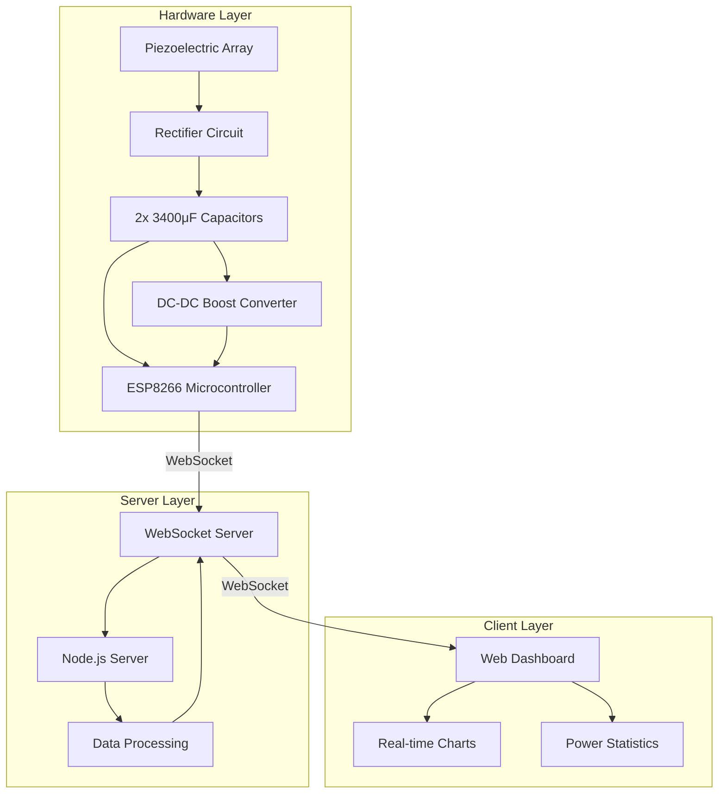
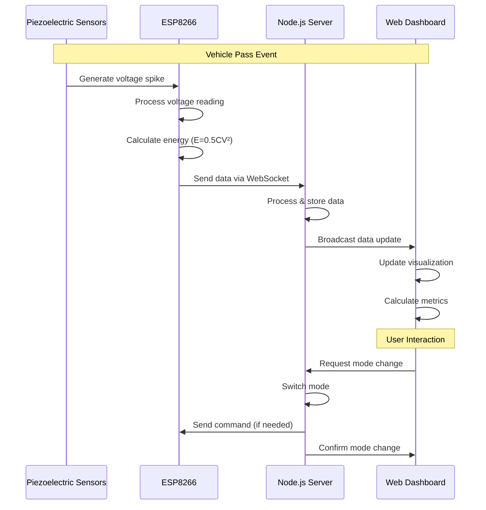

# Piezoelectric Road Power Simulator with ESP8266 + Node.js

A full-stack energy harvesting system that captures mechanical energy from road vibrations using piezoelectric elements, stores the collected energy in batteries, and uses it to power LED lighting. This project combines hardware components with real-time data visualization to provide insights into renewable energy generation from roadway vibrations.


## 📋 Overview

The Piezoelectric Road Power Simulator demonstrates a complete renewable energy cycle:

1. **Energy Harvesting**: Piezoelectric transducers convert mechanical pressure from vehicle passes into electrical energy
2. **Energy Storage**: Harvested energy is stored in dual 3400μF capacitors (6800μF total) and transferred to a battery
3. **Energy Utilization**: The stored energy powers LED lighting, creating a self-sustaining illumination system
4. **Monitoring System**: All aspects of energy generation, storage, and consumption are visualized in real-time

This closed-loop system represents a practical application of piezoelectric energy harvesting that can be implemented in smart roads and high-traffic areas to power roadside lighting.

### Key Features

- **Complete Energy Cycle**: Harvests, stores, and utilizes energy in a self-contained system
- **Dual Capacitor Storage**: Uses two 3400μF capacitors in parallel for efficient energy collection
- **Battery Integration**: Transfers harvested energy to rechargeable batteries for long-term storage
- **LED Illumination**: Powers LED lights directly from harvested road energy
- **Real-time Monitoring**: Displays voltage, energy, and power metrics on a responsive dashboard
- **Vehicle Detection**: Counts vehicle passes and correlates with energy generation
- **Energy Analysis**: Calculates potential runtime for LEDs based on harvested energy
- **Power Insights**: Shows historical data and energy generation patterns
- **Dual Operation Modes**: Live data from hardware or demo mode with simulated data

## 📦 Project Structure

```
/piezoelectric
├── /arduino           → ESP8266 firmware (piezo_harvester.ino and esp8266.ino)
├── /public            → Frontend dashboard (HTML, CSS, JS)
│   ├── index.html     → Main dashboard page
│   ├── style.css      → Dashboard styling
│   └── script.js      → Client-side WebSocket and visualization logic
├── server.js          → Node.js WebSocket server for data handling
├── package.json       → Node.js dependencies
├── ESP8266_SETUP.md   → Hardware setup instructions
└── README.md          → Project documentation
```

## 🔄 System Architecture and Data Flow

### System Components Diagram



### Data Flow Sequence



## 🛠️ Hardware Requirements

- ESP8266 NodeMCU or Wemos D1 Mini
- 9× Piezoelectric disc transducers (1 for detection, 8 for power generation)
- Rectifier circuit (bridge rectifier or diodes)
- **2× 3400μF capacitors** (connected in parallel for energy storage)
- Voltage divider for analog readings (100kΩ/47kΩ)
- Tactile switch for simulating vehicle passes
- Status LEDs for visual indication
- Breadboard and jumper wires
- Micro USB cable for programming and power

## 🧰 Software Requirements

- Node.js (v14.0.0 or higher)
- npm or yarn package manager
- Arduino IDE (for ESP8266 firmware)
- Required Arduino libraries:
  - ESP8266WiFi
  - WebSocketsClient
  - ArduinoJson (version 6.x)
  - EEPROM

## 🌟 Getting Started

Follow these steps to set up and run the Piezoelectric Road Power Simulator:

### Step 1: Hardware Assembly
See the detailed instructions in [ESP8266_SETUP.md](ESP8266_SETUP.md) for:
- Piezoelectric array construction
- Rectifier circuit wiring
- Energy storage configuration using dual 3400μF capacitors
- ESP8266 connections
- Testing procedures

### Step 2: ESP8266 Firmware
1. **Open Arduino IDE** and load `arduino/piezo_harvester.ino`
2. **Update WiFi credentials**:
   ```cpp
   const char* ssid = "YOUR_WIFI_SSID";
   const char* password = "YOUR_WIFI_PASSWORD";
   ```
3. **Set WebSocket server address**:
   ```cpp
   const char* wsHost = "YOUR_SERVER_IP";
   const int wsPort = 3000;
   ```
4. **Upload firmware** to ESP8266

### Step 3: Server Setup
1. **Install dependencies**:
   ```bash
   npm install
   ```
2. **Start the server**:
   ```bash
   npm start
   ```
3. **Verify server** is running on `http://localhost:3000`

### Step 4: Access Dashboard
1. **Open web browser** and navigate to `http://localhost:3000`
2. **Verify WebSocket connection** (green status indicator)
3. **Test data flow** by pressing the tactile switch

## 📊 Usage

### Initial Setup
1. **Power on** the ESP8266 system
2. **Wait for Wi-Fi connection** (onboard LED indicator)
3. **Open dashboard** in web browser
4. **Confirm WebSocket connection** status

### Simulating Vehicle Passes
- **Manual simulation:** Press tactile switch to increment pass counter
- **Physical simulation:** Apply pressure to the main piezoelectric disc

### Dashboard Features
- **Real-time monitoring** of voltage, energy, and power
- **Vehicle pass counter** tracking
- **Energy harvesting metrics** including total energy in joules
- **LED runtime estimation** based on harvested energy
- **Historical data visualization** with adjustable time ranges
- **Power insights** showing peak voltage and average energy per vehicle

### Operation Modes
- **Live Mode**: Connects to ESP8266 hardware for real data
- **Demo Mode**: Simulates piezoelectric data for demonstration purposes

## 🔋 Power Metrics

The system calculates several key metrics:

- **Voltage**: Direct reading from piezoelectric array (V)
- **Energy**: Calculated using capacitor formula E = 0.5 × C × V² (J)
- **Power**: Rate of energy generation (W)
- **Runtime**: Estimated operating time for a load (e.g., LED) based on harvested energy
- **Battery Charge**: Equivalent battery percentage based on energy harvested

## 🧪 Technical Details

### Energy Storage Configuration
The system uses two 3400μF capacitors in parallel:
```
Total Capacitance = C₁ + C₂ = 3400μF + 3400μF = 6800μF
```

This configuration:
- Increases energy storage capacity
- Reduces equivalent series resistance (ESR)
- Improves energy harvesting efficiency

### Energy Calculation
The system uses the following formula to calculate energy:
```
E = 0.5 × C × V²
```
Where:
- E = Energy in joules (J)
- C = Total capacitance in farads (6800μF = 0.0068F)
- V = Voltage in volts (V)

### Runtime Estimation
LED runtime is calculated as:
```
Runtime (seconds) = Energy (J) / Power consumption (W)
```

### Wireless Communication
- **Protocol**: WebSocket for real-time bidirectional communication
- **Data format**: JSON messages containing sensor readings and system status
- **Update frequency**: 2 seconds (configurable)

## 🔄 Project Extensions

Potential ways to extend the project:
- Add solar panel integration for hybrid energy harvesting
- Implement energy efficient deep sleep modes
- Add data logging to SD card or cloud database
- Create mobile companion app using React Native
- Implement machine learning for traffic pattern analysis
- Scale up with multiple sensor nodes along a roadway

## 📜 License

This project is licensed under the MIT License - see the LICENSE file for details.

## 🙏 Acknowledgments

- Special thanks to contributors and testers
- Inspired by sustainable energy research
- Built with open source technologies

## 📞 Contact

For questions or feedback, please open an issue on this repository.
