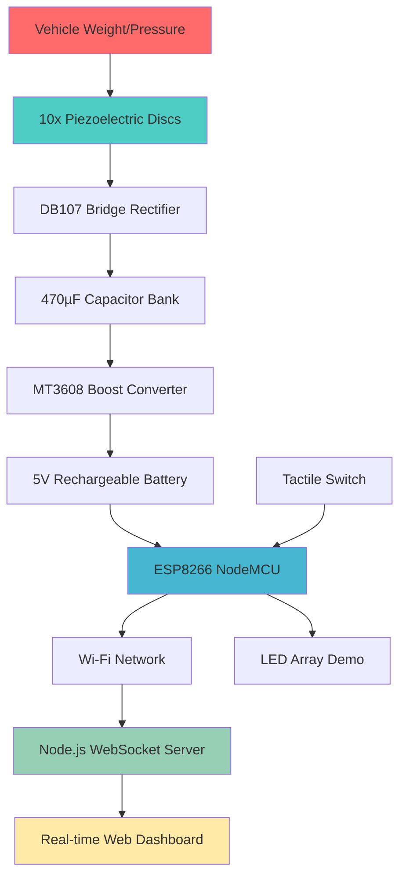
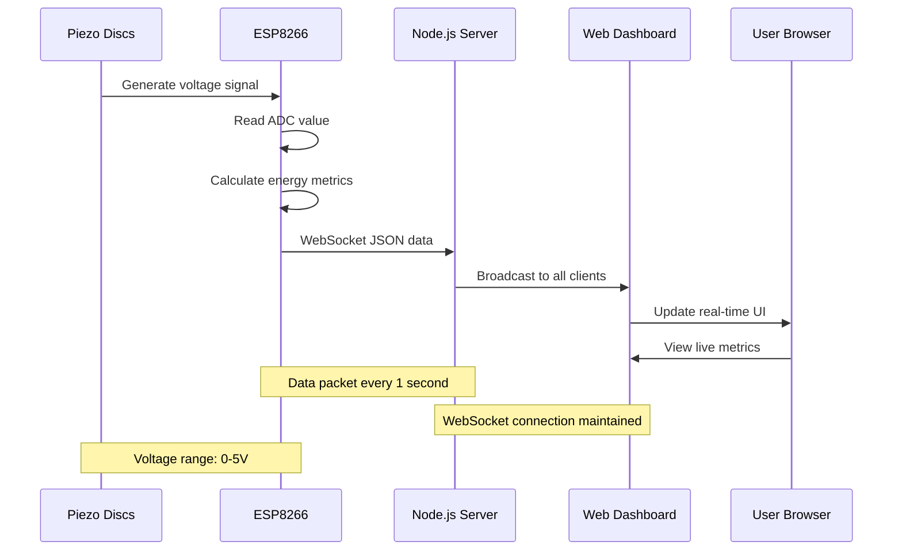

# Vehicle-Based Piezoelectric Power Generation System

An IoT-based prototype demonstrating sustainable energy harvesting from vehicular traffic using piezoelectric technology, monitored through ESP8266 and a real-time Node.js dashboard.

## Project Overview

This project explores the concept of harvesting kinetic energy from vehicles using piezoelectric discs embedded in road surfaces. The harvested energy is processed, stored, and monitored in real-time through a web-based dashboard, demonstrating the potential for **road-powered street lighting** and other infrastructure applications.

### Motivation
With increasing focus on renewable energy and smart city infrastructure, this prototype showcases how everyday vehicular traffic can be converted into usable electrical energy, contributing to sustainable urban development and reducing grid dependency for road lighting systems.

## System Architecture

The system integrates hardware energy harvesting with IoT monitoring capabilities:



**Component Flow:**
- **Energy Generation:** Piezo discs → Rectifier → Capacitor → Booster → Battery
- **Monitoring:** ESP8266 → Wi-Fi → Node.js Server → Web Dashboard
- **Output Demo:** Battery → LEDs (simulating street lighting)

## Hardware Components

| Component | Specification | Quantity | Purpose |
|-----------|---------------|----------|---------|
| **Piezoelectric Discs** | 27mm diameter | 10x | Primary energy harvesting elements |
| **Bridge Rectifier** | DB107 | 1x | AC to DC conversion |
| **Capacitor** | 470µF, 25V | 1x | Energy storage and smoothing |
| **Boost Converter** | MT3608 (2A) | 1x | Voltage regulation (3.3V → 5V) |
| **Battery** | 5V Rechargeable Li-ion | 1x | Energy storage buffer |
| **Microcontroller** | ESP8266 (NodeMCU/Wemos D1) | 1x | IoT connectivity and monitoring |
| **Switch** | Tactile Push Button | 1x | Manual vehicle pass simulation |
| **LEDs** | Standard 5mm | 5-10x | Power output demonstration |
| **Resistors** | 220Ω, 10kΩ | Various | Current limiting and pull-up |

### Circuit Connections
- **Piezo Array** → DB107 (AC input pins)
- **DB107 Output** → 470µF Capacitor → MT3608 Input
- **MT3608 Output** → Battery + ESP8266 VIN
- **ESP8266 GPIO** → Voltage divider → Analog monitoring
- **Tactile Switch** → ESP8266 GPIO (with pull-up resistor)

## Software Components

### Arduino Firmware (ESP8266)
- **Wi-Fi connectivity** with auto-reconnection
- **Analog voltage monitoring** via ADC
- **WebSocket client** for real-time data transmission
- **Vehicle pass detection** through tactile switch interrupt
- **Energy calculation** algorithms

### Node.js Backend
- **Express.js** HTTP server for dashboard hosting
- **WebSocket server** (`ws` library) for real-time communication
- **CORS enabled** for cross-origin requests
- **Static file serving** for frontend assets

### Frontend Dashboard
- **Responsive HTML5/CSS3** with mobile-first design
- **WebSocket client** for live data updates
- **Chart.js integration** for voltage history visualization
- **Dark theme** with green/yellow accent colors
- **Real-time metrics display**

## Installation Guide

### Step 1: Hardware Assembly
1. **Wire piezoelectric discs** in parallel configuration
2. **Connect rectifier circuit:** Piezo → DB107 → Capacitor
3. **Setup boost converter:** Capacitor → MT3608 → Battery
4. **Connect ESP8266:** Battery → NodeMCU power pins
5. **Add monitoring circuit:** Voltage divider → ESP8266 A0 pin
6. **Install tactile switch** with pull-up resistor to GPIO pin

### Step 2: Arduino Firmware
1. Install **ESP8266 Arduino Core** in Arduino IDE
2. Install required libraries:
   ```
   - ESP8266WiFi
   - WebSocketsClient
   - ArduinoJson
   ```
3. **Configure Wi-Fi credentials** in the Arduino sketch
4. **Set WebSocket server IP** (your computer's local IP)
5. **Flash firmware** to ESP8266

### Step 3: Node.js Server Setup
1. **Clone/download** the project repository
2. **Install dependencies:**
   ```bash
   npm install express ws cors
   ```
3. **Start the server:**
   ```bash
   npm start
   ```
4. **Verify server** is running on `http://localhost:3000`

### Step 4: Access Dashboard
1. **Open web browser** and navigate to `http://localhost:3000`
2. **Verify WebSocket connection** (green status indicator)
3. **Test data flow** by pressing the tactile switch

## Usage

### Initial Setup
1. **Power on** the ESP8266 system
2. **Wait for Wi-Fi connection** (onboard LED indicator)
3. **Open dashboard** in web browser
4. **Confirm WebSocket connection** status

### Simulating Vehicle Passes
- **Manual simulation:** Press tactile switch to increment pass counter
- **Roller method:** Use a weighted roller over piezo disc array
- **Pressure application:** Apply consistent pressure to generate voltage

### Dashboard Monitoring
- **Real-time voltage** readings from piezo array
- **Vehicle pass counter** with running total
- **Energy harvested** calculations in millijoules
- **LED runtime estimation** based on current energy storage
- **Historical voltage graph** with 50-point rolling window

## Data Flow



### Data Packet Format
```json
{
  "voltage": 3.2,
  "passCount": 24,
  "energy": 0.0123,
  "estimatedRuntime": 45.6,
  "timestamp": 1640995200000
}
```

## Live Dashboard Features

### Real-time Metrics
- **Voltage Display:** Current piezoelectric output (0-5V range)
- **Pass Counter:** Total vehicle simulations detected
- **Energy Harvested:** Cumulative energy in millijoules
- **LED Runtime:** Estimated lighting duration in minutes

### Visual Interface
- **Dark theme** with green (#4ecdc4) and yellow (#ffeaa7) accents
- **Responsive grid layout** adapting to mobile devices
- **Chart.js line graph** showing voltage history over time
- **Connection status indicator** with auto-reconnection
- **Smooth animations** and hover effects

### Mobile Optimization
- **Touch-friendly interface** for tablet/phone access
- **Flexible grid system** adjusting to screen size
- **Readable typography** with appropriate contrast ratios

## Future Improvements

### Power Optimization
- **Deep sleep mode** implementation for ESP8266
- **Wake-on-interrupt** for vehicle detection
- **Solar panel integration** for system charging

### Enhanced Connectivity
- **ESP32 upgrade** with Bluetooth + Wi-Fi dual mode
- **LoRaWAN integration** for long-range communication
- **Edge computing** capabilities with local data processing

### Real-world Deployment
- **Multiple piezo strip arrays** across road width
- **Weather-resistant enclosures** for outdoor installation
- **Advanced energy storage** with supercapacitor banks
- **Grid-tie inverter** integration for utility connection

### Software Enhancements
- **Historical data logging** with database integration
- **Machine learning** traffic pattern analysis
- **Mobile app development** for remote monitoring
- **Cloud dashboard** with multi-location support

## Technologies Used

### Backend
- **Node.js** - JavaScript runtime environment
- **Express.js** - Web application framework
- **WebSocket (ws)** - Real-time bidirectional communication
- **CORS** - Cross-origin resource sharing

### Frontend
- **HTML5** - Modern markup with semantic elements
- **CSS3** - Responsive design with CSS Grid and Flexbox
- **Vanilla JavaScript** - WebSocket client and DOM manipulation
- **Chart.js** - Interactive data visualization library

### Hardware
- **ESP8266** - Wi-Fi enabled microcontroller
- **Arduino IDE** - Firmware development environment
- **Piezoelectric Technology** - Mechanical to electrical energy conversion

## License & Credits

### License
This project is licensed under the **MIT License** - see the [LICENSE](LICENSE) file for details.


### Contributing
Contributions are welcome! Please feel free to submit a Pull Request. For major changes, please open an issue first to discuss what you would like to change.

### Acknowledgments
- Piezoelectric energy harvesting research community
- ESP8266 Arduino Core contributors
- Chart.js development team
- Open source IoT community

---

**⚡ Powering the future, one vehicle at a time! ⚡**
